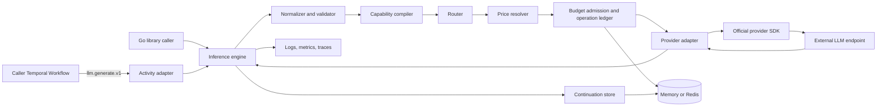

# System Overview

## Architectural style

The system is a hexagonal Go application with a reusable inference core. The
Temporal Activity, CLI process, provider SDKs, Redis, and observability exporters
are adapters around domain packages. The domain has no dependency on Temporal,
provider SDK structs, Redis, Kubernetes, or environment variables.

The central metaphor is a compiler:

```text
semantic request
  -> normalization
  -> capability resolution
  -> route and price resolution
  -> budget admission
  -> provider lowering
  -> official SDK dispatch
  -> provider response lifting
  -> normalized result and continuation
```

## Component relationships



## Request lifecycle

1. **Decode and normalize.** The boundary validates `api_version`, rejects
   unknown enum values, turns an omitted service class into `standard`, and
   canonicalizes IDs and JSON Schema.
2. **Load continuation.** When a handle is present, the engine loads the
   immutable state record, verifies tenant ownership and expiry, and merges the
   new input items after the stored transcript.
3. **Compile candidates.** The capability compiler intersects request features,
   logical model routes, endpoint/model capability declarations, requested
   service class, portability mode, and explicit class fallbacks. It produces
   ordered candidates and diagnostics without contacting a provider.
4. **Resolve price.** Each candidate is tied to one immutable price-catalog
   version. Candidates without a valid price are excluded when budgets apply.
5. **Estimate and admit.** The estimator computes the maximum single-attempt
   bound across the authorized plan. One store operation creates or finds the
   operation ledger entry and reserves that amount against the union of budget
   windows that could match any planned candidate.
6. **Lower.** The selected adapter converts semantic items to official SDK
   parameter types. Provider extensions are applied only after namespaced
   allow-list validation.
7. **Mark dispatch.** Immediately before the SDK transport can write bytes, the
   ledger moves from `reserved` to `dispatching`. Transport instrumentation
   records whether failure occurred before or after a possible write.
8. **Invoke once.** SDK retries are disabled. The Activity context controls the
   deadline and cancellation. Long calls emit small heartbeat details.
9. **Lift and reconcile.** The adapter converts output and stream events back to
   semantic types, captures request IDs and actual service tier, and normalizes
   usage. Pricing uses provider-reported cost when authoritative, otherwise the
   pinned catalog. If a definitely charged failure permits safe fallback, one
   atomic continuation transition finalizes that attempt and reserves the
   remaining plan before another dispatch.
10. **Commit result.** The engine atomically records the completed result,
    creates an immutable child continuation, and refunds unused reservation.
    A repeated operation key returns the recorded result.

If a dispatch outcome is ambiguous, step 10 records `ambiguous` and keeps the
full reservation. It returns a non-retryable error that contains a safe
reconciliation reference, not prompt content.

## Core ports

The implementation must preserve these domain-facing interfaces. Method names
may gain context-specific options, but responsibilities must not collapse into a
single provider-aware service.

```go
type Engine interface {
	Generate(context.Context, llm.Request) (llm.Response, error)
	Stream(context.Context, llm.Request) (llm.EventStream, error)
}

type Adapter interface {
	Compile(context.Context, provider.CompileInput) (provider.Call, error)
	Invoke(context.Context, provider.Call, provider.Observer) (provider.Result, error)
}

type Router interface {
	Plan(context.Context, routing.Input) (routing.Plan, error)
}

type PriceResolver interface {
	Resolve(context.Context, pricing.Query) (pricing.Quote, error)
}

type AdmissionStore interface {
	Begin(context.Context, admission.BeginRequest) (admission.BeginResult, error)
	MarkDispatching(context.Context, admission.DispatchRequest) error
	Continue(context.Context, admission.ContinueRequest) (admission.ContinueResult, error)
	Complete(context.Context, admission.CompleteRequest) error
	Fail(context.Context, admission.FailRequest) error
}

type ContinuationStore interface {
	Get(context.Context, state.Handle) (state.Continuation, error)
	PutChild(context.Context, state.PutChildRequest) (state.Handle, error)
}
```

`AdmissionStore` deliberately joins operation deduplication and budget mutation
at their one required atomic boundary. Pricing, policy matching, estimation,
and window semantics remain reusable packages outside the store.

## Configuration snapshots

Configuration is parsed, defaulted, validated, and compiled into one immutable
snapshot. An Activity captures the current snapshot at start and uses it for its
entire execution. A reload builds a new snapshot off to the side and swaps one
atomic pointer only after all endpoint references, route cycles, capability
claims, prices, budgets, and secret references validate.

The result records the non-secret snapshot digest, route ID, capability version,
and price-catalog version. A continuation retains the snapshot facts needed to
interpret prior provider state but may use a newer route snapshot only when
portability checks permit it.

## Failure domains

| Domain | Required behavior |
| --- | --- |
| Invalid caller input | Fail before state or provider access; non-retryable |
| Unsupported semantic feature | Fail before admission in strict mode; diagnostic drop only in best-effort mode |
| Budget denial | Fail before dispatch; retryable only when `retry_after` fits the Activity schedule |
| Redis unavailable | Fail closed for production budgets and durable continuations |
| Provider definite transient failure | Release/refund as documented; try next candidate only within route bounds |
| Provider ambiguous failure | Keep reservation, record ambiguity, stop automatic retries |
| Worker termination | Temporal retries; ledger returns a completed result or ambiguity instead of blindly repeating |
| Configuration reload failure | Keep serving the last valid snapshot and return the reload error; readiness remains based on the active snapshot and dependency probes |

## Horizontal scaling

With memory state, one worker process is an isolated development environment and
must not advertise distributed durability. With Redis, any replica can receive
an Activity task, load continuation state, detect a prior operation, and enforce
the same shared budgets. Provider SDK clients and compiled configuration are
process-local and immutable; no sticky routing to a pod is required.
